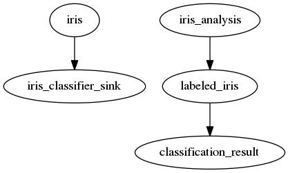

# BeePy

This is a roughly-implemented prototype.

## Install

```
python setup.py install
```

## Tools

Create dependency graph:

```
bin/sensorbee_status_dot 127.0.0.1 15601 jubatus_iris > jubatus_iris.dot
dot -Tpng jubatus_iris.dot -o sample.png
```


Note: finished inputs/outputs are not displayed, as they no longer appear as status values.

Dump all status values from SensorBee server:

```
bin/sensorbee_status 127.0.0.1 15601
```

```js
{
    "runtime_status": {
        "hostname": "localhost",
        "user": "kenichi",
        "gomaxprocs": 4,
        "goversion": "go1.6.2",
        "goroot": "/home/kenichi/local/go",
        "pid": 18742,
        "num_cpu": 4,
        "working_directory": "/home/kenichi/Development/sensorbee-iris-jubatus",
        "num_goroutine": 14,
        "num_cgo_call": 29
    },
    "topologies": {
        "jubatus_iris": {
            "sources": {
                "iris_analysis": {
                    "name": "iris_analysis",
                    "status": {
                        "behaviors": {
                            "remove_on_stop": false,
                            "stop_on_disconnect": false
                        },
                        "output_stats": {
                            "outputs": {
                                "labeled_iris": {
                                    "num_sent": 0,
                                    "queue_size": 1024,
                                    "num_queued": 0
                                }
                            },
                            "num_sent_total": 0,
                            "num_dropped": 0
                        },
                        "state": "paused",
                        "source": {
                            "waiting_for_rewind": false,
                            "rewindable": false
                        }
                    },
                    "meta": {},
                    "state": "paused",
                    "node_type": "source"
                },
                "iris": {
                    "name": "iris",
                    "status": {
                        "behaviors": {
                            "remove_on_stop": false,
                            "stop_on_disconnect": false
                        },
                        "output_stats": {
                            "outputs": {
                                "iris_classifier_sink": {
                                    "num_sent": 0,
                                    "queue_size": 1024,
                                    "num_queued": 0
                                }
                            },
                            "num_sent_total": 0,
                            "num_dropped": 0
                        },
                        "state": "paused",
                        "source": {
                            "waiting_for_rewind": false,
                            "rewindable": false
                        }
                    },
                    "meta": {},
                    "state": "paused",
                    "node_type": "source"
                }
            },
            "sinks": {
                "classification_result": {
                    "name": "classification_result",
                    "status": {
                        "behaviors": {
                            "remove_on_stop": false,
                            "graceful_stop": false,
                            "stop_on_disconnect": false
                        },
                        "input_stats": {
                            "num_received_total": 0,
                            "num_errors": 0,
                            "inputs": {
                                "labeled_iris": {
                                    "queue_size": 1024,
                                    "num_received": 0,
                                    "num_queued": 0
                                }
                            }
                        },
                        "state": "running"
                    },
                    "meta": {},
                    "state": "running",
                    "node_type": "sink"
                },
                "iris_classifier_sink": {
                    "name": "iris_classifier_sink",
                    "status": {
                        "behaviors": {
                            "remove_on_stop": false,
                            "graceful_stop": false,
                            "stop_on_disconnect": false
                        },
                        "input_stats": {
                            "num_received_total": 0,
                            "num_errors": 0,
                            "inputs": {
                                "iris": {
                                    "queue_size": 1024,
                                    "num_received": 0,
                                    "num_queued": 0
                                }
                            }
                        },
                        "state": "running"
                    },
                    "meta": {},
                    "state": "running",
                    "node_type": "sink"
                }
            },
            "streams": {
                "labeled_iris": {
                    "name": "labeled_iris",
                    "status": {
                        "behaviors": {
                            "remove_on_stop": false,
                            "graceful_stop": false,
                            "stop_on_outbound_disconnect": false,
                            "stop_on_inbound_disconnect": true
                        },
                        "input_stats": {
                            "num_received_total": 0,
                            "num_errors": 0,
                            "inputs": {
                                "iris_analysis": {
                                    "queue_size": 1024,
                                    "num_received": 0,
                                    "num_queued": 0
                                }
                            }
                        },
                        "output_stats": {
                            "outputs": {
                                "classification_result": {
                                    "num_sent": 0,
                                    "queue_size": 1024,
                                    "num_queued": 0
                                }
                            },
                            "num_sent_total": 0,
                            "num_dropped": 0
                        },
                        "state": "running"
                    },
                    "meta": {},
                    "state": "running",
                    "node_type": "box"
                }
            }
        }
    }
}
```
